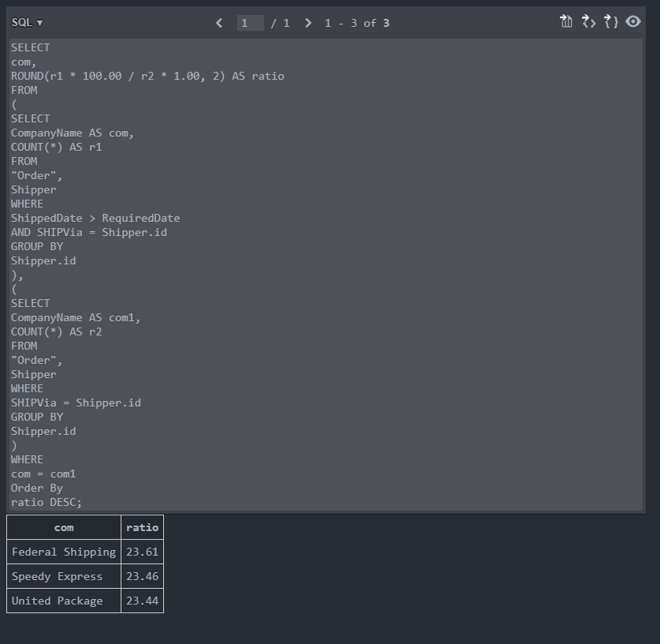
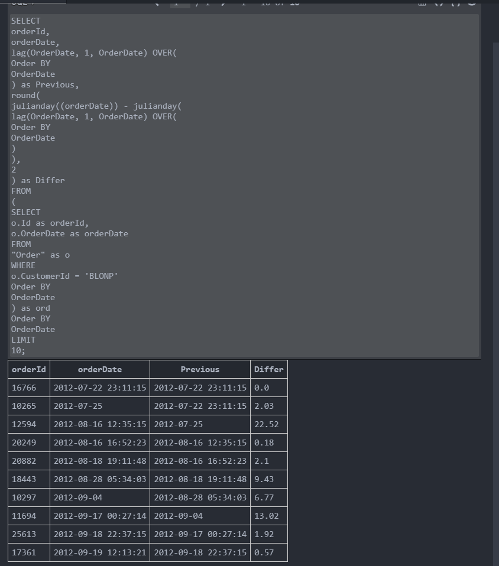

# 数据库作业

<p>
<p><center><span style='font-size:2rem;font-family:楷体;'>姓名：             <ins>王帮文</ins>                            </span></center></p>

<p>
    <center><span style='font-size:2rem;font-family:楷体;'>学号：             <ins>2020141460292</ins>                            </span></center>
</p>

<br/><br/><br/><br/>

- [数据库作业](#数据库作业)
  - [第一次编程作业](#第一次编程作业)
    - [extendible\_hash\_test](#extendible_hash_test)
    - [buffer\_pool\_manager\_test](#buffer_pool_manager_test)
    - [lru\_replacer\_test](#lru_replacer_test)
  - [第一次作业](#第一次作业)
    - [Q1](#q1)
    - [Q2](#q2)
    - [Q3](#q3)
    - [Q4](#q4)
    - [Q5](#q5)
    - [Q6](#q6)
    - [Q7](#q7)
    - [Q8](#q8)

## 第一次编程作业

### extendible_hash_test


### buffer_pool_manager_test


### lru_replacer_test


## 第一次作业

### Q1

```sql
SELECT
    distinct ShipName,
    substr(ShipName, 1, instr(ShipName, '-') -1) as result
FROM
    'order'
WHERE
    ShipName like '%-%'
order by
    ShipName;
```


### Q2

```sql
SELECT
    id,
    shipcountry,
    CASE
        WHEN(shipcountry IN ("USA", "Mexico", "Canada")) THEN "NorthAmerica"
        ELSE "OtherPlace"
    END
FROM
    'Order'
Limit
    20 offset 15445 -10248;
```


### Q3

```sql
SELECT
	com,
	ROUND(r1 * 100.00 / r2 * 1.00, 2) AS ratio
FROM
	(
		SELECT
			CompanyName AS com,
			COUNT(*) AS r1
		FROM
			"Order",
			Shipper
		WHERE
			ShippedDate > RequiredDate
			AND SHIPVia = Shipper.id
		GROUP BY
			Shipper.id
	),
	(
		SELECT
			CompanyName AS com1,
			COUNT(*) AS r2
		FROM
			"Order",
			Shipper
		WHERE
			SHIPVia = Shipper.id
		GROUP BY
			Shipper.id
	)
WHERE
	com = com1
Order By
	ratio DESC;
```

 [Q3.sql](第一次作业/Q3.sql) 



### Q4

```sql
SELECT
    CategoryName,
    count(*) as cnt,
    round(avg(UnitPrice), 2) as average,
    min(UnitPrice) as mini,
    max(UnitPrice) as maxi,
    sum(UnitsOnOrder) as sum
FROM
    Category as c,
    Product
WHERE
    CategoryId = c.Id
    
GROUP BY
    c.Id
HAVING
    sum > 10
```


### Q5

```sql
SELECT
    pname,
    comname,
    contname
FROM
    (
        SELECT
            p.ProductName as pname,
            ord.CustomerId as cid,
            min(ord.OrderDate) as date,
            cu.CompanyName as comname,
            cu.ContactName as contname
        FROM
            OrderDetail as od,
            (
                SELECT
                    *
                from
                    Product
                WHERE
                    Product.Discontinued = 1
            ) as p,
            "order" as ord,
            Customer as cu
        WHERE
            od.OrderId = ord.Id
            AND od.ProductId = p.Id
            AND cid = cu.id
        GROUP BY
            pname
    )
```


### Q6

```sql
SELECT
    orderId,
    orderDate,
    lag(OrderDate, 1, OrderDate) OVER(
        Order BY
            OrderDate
    ) as Previous,
    round(
        julianday((orderDate)) - julianday(
            lag(OrderDate, 1, OrderDate) OVER(
                Order BY
                    OrderDate
            )
        ),
        2
    ) as Differ
FROM
    (
        SELECT
            o.Id as orderId,
            o.OrderDate as orderDate
        FROM
            "Order" as o
        WHERE
            o.CustomerId = 'BLONP'
        Order BY
            OrderDate
    ) as ord
Order BY
    OrderDate
LIMIT
    10
```



### Q7

```sql
SELECT
    ifnull(CompanyName, "MISSING_NAME") as CompanyName,
    CustomerId,
    exp
FROM
    (
        SELECT
            CustomerId,
            NTILE(4) OVER (
                ORDER BY
                    res.exp
            ) as ntiles,
            exp
        FROM
            (
                SELECT
                    CustomerId,
                    round(sum(UnitPrice * Quantity), 2) as exp
                FROM
                    "order" as ord,
                    OrderDetail as od
                WHERE
                    ord.id = od.OrderId
                GROUP BY
                    CustomerId
            ) as res
    )
    LEFT OUTER JOIN Customer ON CustomerId = Customer.Id
WHERE
    ntiles = 1
```


### Q8

```sql
SELECT
    Region.RegionDescription,
    Employee.FirstName,
    Employee.LastName,
    max(Employee.BirthDate) as BirthDate
FROM
    EmployeeTerritory,
    Employee,
    Territory,
    Region
WHERE
    EmployeeTerritory.EmployeeId = Employee.Id
    and Territory.RegionId = Region.Id
    and EmployeeTerritory.TerritoryId = Territory.Id
GROUP BY
    Region.Id
```


